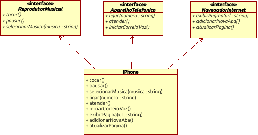

## Modelagem e Diagramação de um Componente iPhone

Funcionalidades a Modelar

### Reprodutor Musical
 Métodos: tocar(), pausar(), selecionarMusica(String musica)

### Aparelho Telefônico
 Métodos: ligar(String numero), atender(), iniciarCorreioVoz()

### Navegador na Internet
 Métodos: exibirPagina(String url), adicionarNovaAba(), atualizarPagina()

---

Diagrama elaborado com a ferramenta Umbrello

